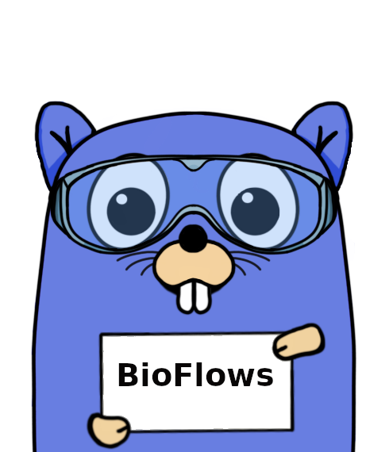

BioFlows Distributed Pipeline Engine
====================================
Distributed Containerized Bioinformatics and Computational Workflows/Pipeline Engine built in Golang

BioFlows is a distributed pipeline framework for expressing , designing and running scalable reproducible and distributed computational bioinformatics workflows in cloud containers.

BioFlows Framework consists of software tools and cloud microservices that communicate together to achieve a highly distributed , highly coordinated and fault tolerant environment to run parallel bioinformatics pipelines onto cloud containers and cloud servers.

BioFlows also has BioFlows Description Language (BDL) which is an imperative and declarative standard for describing and expressing computational bioinformatics tools and pipelines, BDL is flexible , easy to use and a human readable language that enables researchers to design reproducible and scalable computational pipelines.

The language is based entirely on Yet Another Markup Language (YAML).

Read More
=========
You can read more from 

http://bioflows2.readthedocs.org

 
How To Contribute To BioFlows
=============================
 
 If you want to contribute to this project:
 
As A Developer
-------------

You can find the source code of the project publicly available on Github
 
Please send a contribution request via Github to give you writing permission to the project.
 
 
As A Bioinformatician/Researcher
--------------------------------

If you are a bioinformatician or a researcher and would like to issue a new bug, an enhancement or a new feature to BioFlows, please create a new issue on GitHub Project page and we will work on it as soon as we can.
 
 
 
