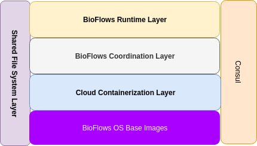
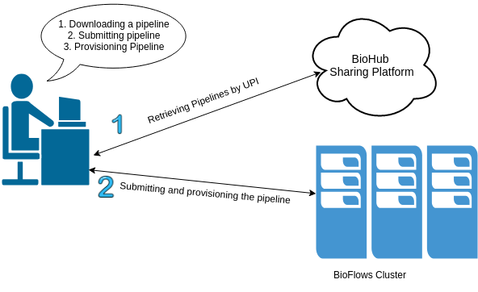
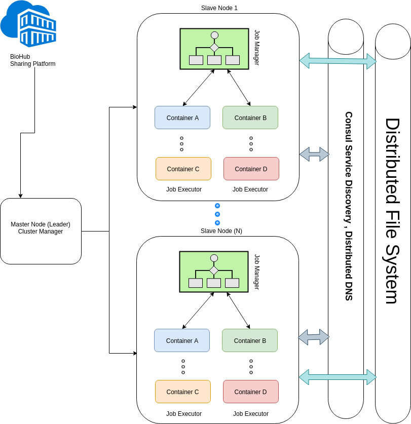

BioFlows Architecture
#####################

There are two major tiers that makeup BioFlows Framework. this section describes these two major tiers and outlines their structure, layers, and tools.

In addition, we describe the methods and protocols used in establishing bidirectional communication among different microservices.

(Cluster/Server) Tier
=====================

This tier consists of all tools and different daemonized microservices which makes up the runtime and the distributed execution environment of BioFlows Framework and ensures consistent and scalable cloud environment.

Pipelines run in a fully distributed, resilient and fault tolerant environment, this tier consists of many layers which communicate among each other to provide consistency, durability, fault tolerance and speed for running different computational pipelines.

The following figure (1-1) explains the structure of this component, its layers and then we move deeper into intricate details of how all these layers and tools communicate to achieve fully distributed and resilient execution cloud environment.

As Shown in the picture above, The cluster/server tier is composed of multiple layers stacked together to form a solid distributed, resilient, fault tolerant and scalable cloud runtime environment where different pipelines run to achieve speed, consistency, and reliability.

The image shows the level of abstraction for each layer starting from BioFlows OS Base Images way up to Bioflows Runtime Layer, the following section describes each layer in detail.

BioFlows OS Images
^^^^^^^^^^^^^^^^^^

BioFlows Framework allows computational pipelines to run onto different cloud containers, each step or tool in a pipeline, when scheduled by Cluster Scheduler, will run on its own container.

These containers run on a homogenous unified Operating system image where they share all basic computational tools and dependencies.

Moreover , the job executor on each container makes sure that each tool has its own dependencies resolved and installed in the container before the tool run.

Otherwise, the job executor reports back any errors or failure to the job manager which spawned the container, we will discuss the coordination logic later in this paper

Cloud Containerization Layer
^^^^^^^^^^^^^^^^^^^^^^^^^^^^

This layer consists of the underlying Unix/Linux Containerization technology, which is used by the Job manager to spawn new containers on a host node, BioFlows framework supports Docker and Singularity Containers.

In addition, BioFlows was built with flexibility and extensibility  in mind and thus can accommodate other containerization technology.

BioFlows Coordination Layer
^^^^^^^^^^^^^^^^^^^^^^^^^^^

BioFlows Framework is a scalable distributed Ecosystem for managing massively parallel computational pipelines over a cluster of host machines.

BioFlows has a distributed queue management system, network protocols like AMQP, RPC (Remote procedure calls) used for direct microservice-to-microservice communications, intelligent resource allocation and leader election algorithms implemented in the cluster manager microservice.

In addition, BioFlows has a shared File System where intermediate and final results from different running tools are stored, this file system is shared among containers instances and mounted automatically for each container during the spawning process by the job manager.

Furthermore,  BioFlows has consul which is a service mesh solution providing a full-featured control plane for service discovery, configuration and segmentation functionality in fully automated and distributed environment.

Moreover, consul is being used as orchestrator to build cluster topologies on the fly and to act as a distributed in-memory key value store, where transient configurations and data are being stored and shared among different container instances during execution.

Furthermore , BioFlows Framework uses consul as a distributed DNS Store where different microservices can discover other services for direct communication in a fully automated way.

BioFlows Runtime Layer
^^^^^^^^^^^^^^^^^^^^^^

This layer consists of major BioFlows microservices and tools that coordinate between each others and make up BioFlows distributed system.
These tools include Cluster Manager , Job Managers, and job executors.

Client Tier - Client Toolkit
============================

BioFlows also has client toolkit which consists of a set of different  command line tools which can be used to author new computational pipelines , validate a pipeline, communicate with BioFlows Biohub to submit or retrieve pipelines and/or tools, communicate with BioFlows Cluster and many other functionalities.

BioFlows Sharing Platforms
==========================

Reproducibility and zero configuration are of utmost importance in any scientific research, It has been a well known problem to reproduce  results of computational bioinformatics analyses of other researchers.

BioFlows Framework praises the concept of “Sharing is Caring” and for this, we have built BioHub which is a centralized cloud sharing platform of computational bioinformatics pipelines that require zero configuration to run.

BioFlows Client Toolkit eases the task of searching, downloading, submitting and provisioning these pipelines onto BioFlows Distributed Cluster with zero configuration and no time.
BioHub component introduces some interesting security challenges that we will discuss a bit later.
Moreover, BioFlows Framework is bridging the gap between deep technical skills , code development and infrastructure operations.
Since , by using flows framework researchers and biologists with no computer skills can still administer flows framework to obtain , submit and provision bioinformatics pipelines onto cluster of machines so easily with no prior knowledge for the underlying technologies used thus increasing their focus on the most important aspects of their research and to find answers to their research questions.

In addition, researchers can author new computational pipelines from known tools registry or defining their own tools then piping them into a workflow, setting explicit parameters, defining execution constraints and other parameters for each tool and/or in the workflow itself, afterward, researchers should validate the workflow on their research data sets after making sure that the workflow is validated and it works correctly they can share it with other researchers who might be seeking answers to similar research questions.

Below clearly shows BioFlows cloud Cluster Architecture and its major components in a clearer way

