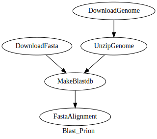

Blast Search Tutorial
#####################

In this tutorial, we are going to perform a blast search against a simple local Blast database.
BLAST is a tool bioinformaticians use to compare a sample genetic sequence to a database of known seqeuences;
it’s one of the most widely used bioinformatics tools. We will follow an existing blast tutorial but we will convert the whole practice
into bioflow pipeline.

You can find the original tutorial website by clicking `here <https://pawseysc.github.io/container-workflows/08-bio-example/index.html>`_. Please open it in another browser tab.

Bioflows Command Line
^^^^^^^^^^^^^^^^^^^^^

Open a new terminal window and execute `bf` executable.

.. code-block:: bash

    $ bf
        BioFlows is a distributed pipeline framework for expressing ,
    designing and running scalable reproducible and distributed computational bioinformatics workflows in cloud containers.
    BioFlows Framework consists of software tools and cloud microservices that communicate together to achieve a highly distributed ,
    highly coordinated and fault tolerant environment to run parallel bioinformatics pipelines onto cloud containers
    and cloud servers. BioFlows also has BioFlows Description Language (BDL) which is an imperative and declarative standard for
    describing and expressing computational bioinformatics tools and pipelines, BDL is flexible , easy to use
    and a human readable language that enables researchers to design reproducible and scalable computational pipelines.
    The language is based entirely on Yet Another Markup Language (YAML).

            Usage:
              bf [command]

            Available Commands:
              Dag         This command enables creation of GraphViz graph for BioFlows Pipeline
              Hub         Helper actions to interact with BioFlows centralized hub which contains published tools and pipelines
              Node        A group of helper commands which enables joining remote cluster or starts a local cluster of Bioflows workers
              Show        This command enables manipulation of tools and BioFlows Pipeline(s)
              Tool        Helper commands to manage and run single BioFlows Tools
              Workflow    A group of helper commands that allow manipulating, managing , running and submitting BioFlows Pipeline(s)
              help        Help about any command
              validate    validates a given BioFlows tool or pipeline definition file. It checks whether the file is valid and well-formatted or not.
                    The file path could be a Local File System Path or a remote URL.

            Flags:
                  --config string          config file (default is $HOME/.bf.yaml)
                  --data_dir string        The directory which contains raw data.
              -h, --help                   help for bf
                  --output_dir string      Output Directory where the running tool will save data.
                  --params_config string   A file which contains your Pipeline specific initial parameters' values. You can know the required parameters for your pipeline through reading its definition file or running bf validate command.
              -t, --toggle                 Help message for toggle
              -v, --version                version for bf

            Use "bf [command] --help" for more information about a command.

Creating the pipeline
^^^^^^^^^^^^^^^^^^^^^

.. code-block:: yaml

    id: blast_prions
    type: pipeline
    name: Blast_Prion
    description:
      -"We’ll be running a BLAST (Basic Local Alignment Search Tool) example with a container from BioContainers. BLAST is a tool bioinformaticians use to compare a sample genetic sequence to a database of known seqeuences; it’s one of the most widely used bioinformatics tools."
    website: https://pawseysc.github.io/container-workflows/08-bio-example/index.html
    version: 0.0.1
    steps:

As you can see, this is a pipeline tool with `type: pipeline` with a name, description, version and a reference to the original practice URL. The original author of the tutorial has downloaded a query fasta sequence and a genome sequence. He then used the genome sequence to create a local blast database index
to use for fast local search using blastp tool, because the query sequence is a protein not a DNA, this is why we are going to use `blastp`.

There are many ways of how you design this pipeline yourself. you can simply download the original data first and put them in a folder and then add only `makeblastdb` and blast search steps in a pipeline or
you can create two steps to download the data first and then followed by `makeblastdb` and `blast search` steps.

Please read the original practice first to understand what the author is doing and then read the following `YAML` file which includes all the steps.

.. code-block:: yaml

    id: blast_prions
    type: pipeline
    name: Blast_Prion
    description:
      -"We’ll be running a BLAST (Basic Local Alignment Search Tool) example with a container from BioContainers. BLAST is a tool bioinformaticians use to compare a sample genetic sequence to a database of known seqeuences; it’s one of the most widely used bioinformatics tools."
    website: https://pawseysc.github.io/container-workflows/08-bio-example/index.html
    version: 0.0.1
    steps:
      - id: DownloadFasta
        name: DownloadFasta
        inputs:
          - type: string
            displayname: URL for fasta file
            name: fasta_url
            value: http://www.uniprot.org/uniprot/P04156.fasta
        outputs:
          - type: file
            name: fasta_file
            value: "{{self_dir}}/P04156.fasta"
        command: "wget -O {{fasta_file}} {{fasta_url}}"
      - id: DownloadGenome
        name: DownloadGenome
        inputs:
          - type: string
            name: gfasta_url
            value : "ftp://ftp.ncbi.nih.gov/refseq/D_rerio/mRNA_Prot/zebrafish.1.protein.faa.gz"
        outputs:
          - type: file
            name: hs_gfasta
            value: "{{self_dir}}/zebrafish.1.protein.faa.gz"
        command: "curl -O {{gfasta_url}}"
      - id: UnzipGenome
        name: UnzipGenome
        depends: DownloadGenome
        command: "gunzip {{DownloadGenome.hs_gfasta}}"
        outputs:
          - type: file
            name: hs_fasta
            value: "{{DownloadGenome.location}}/zebrafish.1.protein.faa"

      - id: MakeBlastdb
        name: MakeBlastdb
        depends: DownloadFasta,UnzipGenome
        imageId: biocontainers/blast:v2.2.31_cv2
        command: "makeblastdb -in {{UnzipGenome.hs_fasta}} -dbtype prot"
      - id: FastaAlignment
        name: FastaAlignment
        depends: MakeBlastdb
        imageId: biocontainers/blast:v2.2.31_cv2
        outputs:
          - type: file
            name: results_file
            value: "{{self_dir}}/results.txt"
        command: "blastp -query {{DownloadFasta.fasta_file}} -db {{UnzipGenome.hs_fasta}} -out {{results_file}}"

Of course, if you understood the original practice well, these steps are self-explanatory. Please read carefully how the parameters are linked together.

Save that into a file, for instance, `prions.yaml`..

Drawing Pipeline Diagram
^^^^^^^^^^^^^^^^^^^^^^^^
Now we have a reusable real bioinformatics pipeline that does something useful in practice and it is decoupled from any host file system. Now, assume that you are writing up
your publication paper and need to have a visual diagram of this pipeline to include in your publication. All you need to do is to run the following `bf` command to have a publishable grade diagram.

First, you need to install graphviz software by running the following command.

.. code-block:: bash

    $ sudo apt-get install graphviz

Second, you run `bf Dag` command like so..

.. code-block:: bash

    $ bf Dag /your/script/location/prions.yaml | dot -Tsvg > prions.svg

If you opened the current working directory of where you run this command, you will find a file named `prions.svg` into the current working directory. double-click on this file to view it.

It will look something like..

Running your Pipeline
^^^^^^^^^^^^^^^^^^^^^

You can now easily run your pipeline giving only the output directory where the engine will save the folders of each step including all the results files.

.. code-block:: yaml

    $ bf Workflow run --output_dir=/your/output/directory --data_dir=/any/other/data/directory /your/script/location/prions.yaml

